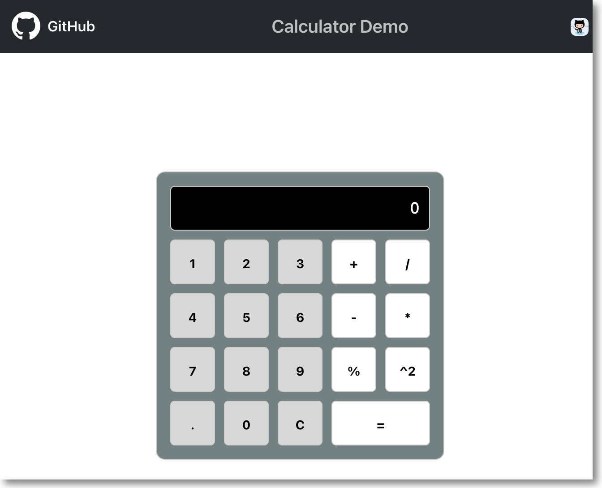

# Workshop 1

## Prerequisites
- NodeJS: v19.7.0
- NPM: v9.5.0
- VSCode & VSCode Extensions:
  - [Copilot](https://marketplace.visualstudio.com/items?itemName=GitHub.copilot)
  - [Copilot Chat](https://marketplace.visualstudio.com/items?itemName=GitHub.copilot-chat)

### Overview

このWorkshopの目的は、VS Code内でCopilotの機能を理解し、Copilotと効果的に対話するさまざまな方法を知ることです。

CopilotとCopilot Chatは、同じバックエンド技術に基づいて構築されていますが、統合開発環境（IDE）内で異なる役割を果たします。簡単に言うと、**Copilot はコーディング・アシスタント** として機能し、コード内のコンテキストに応答します。一方、**Copilot Chat はリサーチ・アシスタント** として機能し、Copilot とよりインタラクティブな共同作業を行うためのチャット・ベースのコミュニケーションを可能にします。

この演習では、Copilotをコード提案に活用するため、Copilotの応答がコンテキストによって異なる場合があることに注意してください。Copilotのダイナミックな機能を示すため、このような変化は歓迎します。

Copilotと効果的に対話するためには、Copilotはあなたの指導と監督によって恩恵を受けるということを心に留めておくことが不可欠です。

---

## Before you Start 

それでは `calculator` appをセットアップしましょう。

---

### Start the `Calculator` App

```bash
npm install
npm start
``` 

- ブラウザを起動し (http://localhost:3000), Appを表示します。

> **Note:** 初回起動時にはこのように表示されます。


> **Note:** このワークショップの終了時には、このように表示されます。

 

---

### UIの確認
ユーザーインタフェースを確認しましょう。
- Copilotアイコン
- Copilot Chatアイコン


(This repository is also known as copilot-operations-demo)