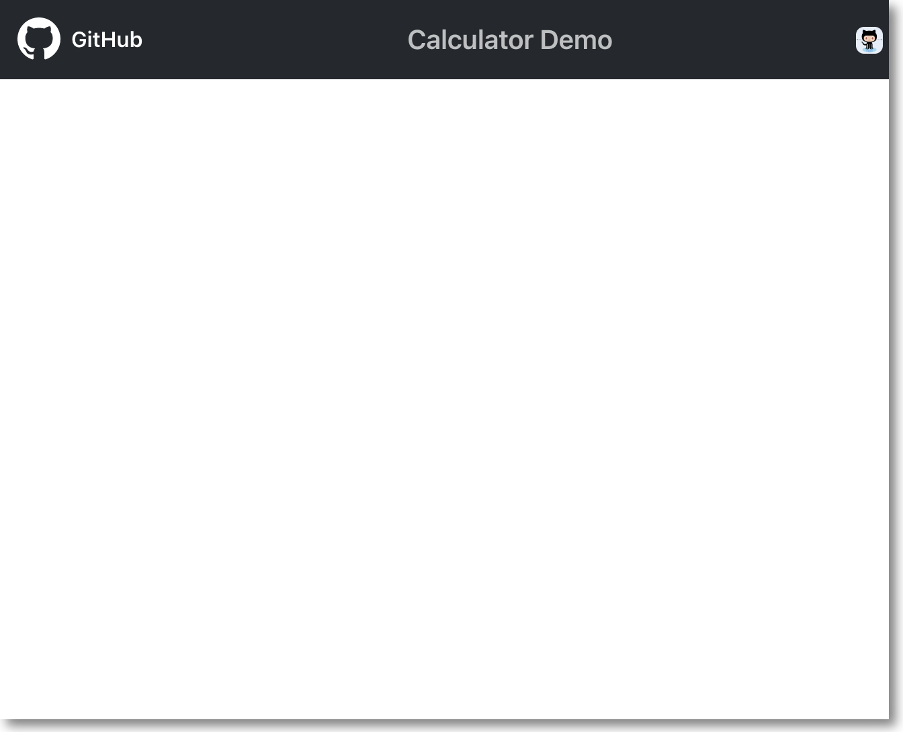

# Workshop 1

## Prerequisites
- NodeJS: v19.7.0
- NPM: v9.5.0
- VSCode & VSCode Extensions:
  - [Copilot](https://marketplace.visualstudio.com/items?itemName=GitHub.copilot)
  - [Copilot Chat](https://marketplace.visualstudio.com/items?itemName=GitHub.copilot-chat)

### Overview

このWorkshopの目的は、VS Code内でCopilotの機能を理解し、Copilotと効果的に対話するさまざまな方法を知ることです。

CopilotとCopilot Chatは、同じバックエンド技術に基づいて構築されていますが、統合開発環境（IDE）内で異なる役割を果たします。簡単に言うと、**Copilot はコーディング・アシスタント** として機能し、コード内のコンテキストに応答します。一方、**Copilot Chat はリサーチ・アシスタント** として機能し、Copilot とよりインタラクティブな共同作業を行うためのチャット・ベースのコミュニケーションを可能にします。

この演習では、Copilotをコード提案に活用するため、Copilotの応答がコンテキストによって異なる場合があることに注意してください。Copilotのダイナミックな機能を示すため、このような変化は歓迎します。

Copilotと効果的に対話するためには、Copilotはあなたの指導と監督によって恩恵を受けるということを心に留めておくことが不可欠です。

---

## Before you Start 

それでは `calculator` appをセットアップしましょう。

---

### Start the `Calculator` App

```bash
npm install
npm start
``` 

- ブラウザを起動し (http://localhost:3000), Appを表示します。

> **Note:** 初回起動時にはこのように表示されます。



> **Note:** このワークショップの終了時には、このように表示されます。

 

---

### UIの確認
ユーザーインタフェースを確認しましょう。
- Copilotアイコン
- Copilot Chatアイコン

### Copilot Chatを操作しましょう
1. src/App.jsを開きます。
2. `Copilot Chat`アイコンをクリックし、`/help`と入力します。コマンドを確認しましょう。
3. Copilot Chatで`このファイルは何を処理していますか`や`/explain`と入力してみましょう。
4. 回答が表示された場合は`Used Reference`をチェックしてみましょう。
5. App.jsファイルをスクロールし、何も表示されていない＆何も選択されていない条件で、`このファイルは何を処理していますか`や`/explain`と入力してみましょう。
6. 何か表示されましたか？もしそうなら、何が表示されましたか？(5月の最新版ではどこをリファレンスするかを問われます。)

### Copilotを操作しましょう
1. src/App.jsを開きます。
2. 11行目にカーソルを移動し、Enterキーを押します。
3. Copilotが提案したコードを確認しましょう。
4. 提案ウィンドウを確認してください。複数提案された場合は、矢印で表示することができます。
5. Tabで提案を受け入れてください

### Inline Copilot Chatを操作しましょう
1. 一度直前に受け入れた提案を消去します。
2. バルーンやスパークルのアイコンが出ることを確認します。
3. Generate Using Copilotが表示された場合は、それをクリックしてください。
4. Inline Chatのダイアログで`/fix`を入力し提案を表示してみましょう。
5. 提案が表示されたら、それを受け入れてください。

（Tips:バルーンやスパークルのアイコンからは、次にアクション可能な操作を選択できます（Explain、Fixなど）次のアクションがプリセットされていなくてもInline Chatを利用可能です。）

### 提案を受け入れます
1. App.jsファイルの提案を受け入れ、ファイルを保存します。
2. ブラウザにて、変更がリアルタイムに反映されていることを確認します。
3. アプリケーションが正しく動いていることを確認します。

### アプリの修正をしましょう
1. App.jsファイルを開いたままにします。
2. Copilot Chatを開き、`四則演算ができません`と入力します。
3. Copilotがどのファイルを修正するかを教えてくれた場合はそのファイルを開きます。教えてくれない場合は、聞き方を変えてみましょう。例えば、「このコードの断片では、Calculator コンポーネントの実装が示されていません。計算結果が正しくない問題を解決するためには、Calculator コンポーネントのコードを確認する必要があります。Calculator コンポーネントのコードを提供していただければ、問題の特定と修正の提案が可能です。」のような回答があった場合はその実装コードを開いて表示します。
4. src/components/Calculator.jsファイルを開きます。
5. Copilot Chatを開き、`四則演算ができません`と入力します。カーソルの位置を変更したり、選択部分を変えたりしてReferenceや回答がどう変わるか確認してみましょう。
6. 55行目にカーソルを移動し、Enterキーを押します。
7. 前回行った手順と同様にスパークルアイコンで`/fix`を表示してみましょう。
8. 提案を見たら今度は受け入れないでください。代わりに、提案を元に手動で修正してみましょう。
9. 56行目に、`swtich`と入力しはじめましょう。
10. Copilotが提案するコードを確認し、提案を受け入れてください。
11. 割り算で止まる可能性もありますので、Copilotと一緒にペアプロしてください。
12. コードを保存し、ブラウザで変更がリアルタイムに反映されていることを確認します。

### その他
1. Switchの部分を選択し、Copilot Chatで`SwitchではなくIfを利用したいです`と入力してみましょう。
2. 例えば割り算を`result = number1 / number2;`にしていた場合`/fix`を入力してみましょう。
3. Copilot Chatで`このファイルをリファクタしたい`と入力してみましょう。
4. Copilot Chatで`@workspace このファイルをリファクタしたい`と入力してみましょう。一つ前のコマンドとの違いを確認してください。

### 計算部分を別関数にしましょう
1. Switchの部分を選択し、Copilot Chatで`このロジックを別の関数にしてください`と入力してみましょう。
2. Copilot Chatでコードが表示された場合は、クリップボードに入れたり、カーソル部分にインサートしたり、新しいファイルに生成することができます。
3. 生成された関数をCalculator.jsに追加し、呼び出し元のSwitchの部分を修正してください。
例 'result = calculate(number1, number2, operator);'

### テストコードを追加しましょう
1. 最後に追加した関数に対してテストコードを追加しましょう。Copilot Chatで`この関数に対してテストコードを追加してください`または`/Tests`と入力してみましょう。
2. 生成されたテストコードを、App.test.jsに保存してください。
3. テストを実行し、正常に動作することを確認してください。テスト実行方法はCopilotに聞いてみましょう。

例：Copilot ChatのクリップアイコンからCalcurator.jsを選択し、`calcurator関数のテストコードをApp.test.jsから呼び出したい`と記載し、`npm test`を実行（あらかじめcalculator関数をexportしておくと良いです）


(This repository is also known as copilot-operations-demo)