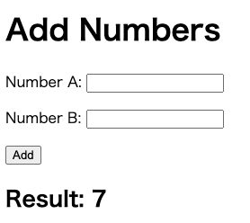

# Workshop 2
新規アプリケーションを作成し、CopilotとCopilot Chatを使用して、コントローラー、テスト、ユーザーインタフェースを作成します。

## Prerequisites
- JDK
- Maven 
- VSCode Extensions:
  - [GitHub Copilot](https://marketplace.visualstudio.com/items?itemName=GitHub.copilot)
  - [GitHub Copilot Chat](https://marketplace.visualstudio.com/items?itemName=GitHub.copilot-chat)
  - [Extension Pack for Java](https://marketplace.visualstudio.com/items?itemName=vscjava.vscode-java-pack)
  - [Spring Boot Extension Pack](https://marketplace.visualstudio.com/items?itemName=vmware.vscode-boot-dev-pack)

### Overview

このWorkshopの目的は、VS Code内でCopilotの機能を理解し、Copilotと効果的に対話するさまざまな方法を知ることです。

CopilotとCopilot Chatは、同じバックエンド技術に基づいて構築されていますが、統合開発環境（IDE）内で異なる役割を果たします。簡単に言うと、**Copilot はコーディング・アシスタント** として機能し、コード内のコンテキストに応答します。一方、**Copilot Chat はリサーチ・アシスタント** として機能し、Copilot とよりインタラクティブな共同作業を行うためのチャット・ベースのコミュニケーションを可能にします。

この演習では、Copilotをコード提案に活用するため、Copilotの応答がコンテキストによって異なる場合があることに注意してください。Copilotのダイナミックな機能を示すため、このような変化は歓迎します。

Copilotと効果的に対話するためには、Copilotはあなたの指導と監督によって恩恵を受けるということを心に留めておくことが不可欠です。

---

## Before you Start 

それでは新規アプリケーションを準備しましょう

1. VSCodeを起動
2. GitHub Copilotに聞いてみましょう
ここで一度GitHub Copilotにどのように新規作成するかを尋ねてみましょう。
例：`Java, Springでウェブアプリを作成したいです。どのように作成したらいいですか。`

改めて、新規アプリケーションを準備しましょう

1. VSCodeを起動します
2. コマンドパレット開く (command + shift + p)
3. `Spling Initilizr`と入力し、`Spring Initializr: Generate a Maven Project`を選択
4. GroupId: `com.example`, ArtifactId: `demo`, PackageType:`Jar`, Dependencies: `Spring Web`と`Thymeleaf`を選択
5. プロジェクトを保存するディレクトリを選択
6. プロジェクトを開きます
7. ビルド実行してみます

```bash
mvn clean install
./mvnw spring-boot:run
``` 
Tips:コマンドを忘れてもCopilot Chatで聞いてみるのもいいでしょう

## 1つ目のコントローラーの作成
シンプルなコントローラーを作成しましょう

1. Copilot Chatにコントローラーを追加する方法を尋ねてみましょう
例：`ルートにアクセスするとHello Worldを表示するコントローラーを作成したいです`
2. 提案されたコードから新規ファイルを作成してみましょう
例：ファイル名　`src/main/java/com/example/demo`に`HelloController.java`
3. 保存し、ビルドを実行してみましょう

```bash
./mvnw spring-boot:run
```

4. アクセスしてみましょう
例：@GetMapping("/")の場合は、http://localhost:8080/ 

5. エラーが出ている場合はCopilot Chatに聞いてみましょう

<details>
  <summary>サンプルソリューション</summary>

1. `src/main/java/com/example/demo`に`HelloWorldController.java`を作成
2. 以下のコードを追加

```java
package com.example.demo;
import org.springframework.web.bind.annotation.GetMapping;
import org.springframework.web.bind.annotation.RestController;

@RestController
public class HelloWorldController {

    @GetMapping("/")
    public String helloWorld() {
        return "Hello World";
    }
}
```

</details>

## 2つ目のコントローラーの作成
2つ目のコントローラーを作成しましょう。<br>
パラメーターを２つ受け取り、結果を返すコントローラーを作成します。
CopilotおよびCopilot Chatを使用して、コントローラーを作成します。

1. `src/main/java/com/example/demo`に`CalcController.java`を作成
2. 次のコードを記載します
    
    ```java
    package com.example.demo;

    import org.springframework.web.bind.annotation.GetMapping;
    import org.springframework.web.bind.annotation.RestController;

    @RestController
    public class CalcController {
        //パラメーター2個を受け取り、その合計を返す
        
    }
    ```
3. コメントの行にカーソルを合わせ、Enterキーを押します
4. Copilotの提案を受け入れてください
5. 必要に編集し、保存し、ビルドを実行してみましょう

Tips: コードを選択し、`How to test?`とChatに聞くと、テスト方法が提案されます
例
`ブラウザまたはHTTPクライアントツール（Postmanやcurlなど）を使用して、以下のURLにGETリクエストを送信します。
   http://localhost:8080/add?a=数値1&b=数値2
   例: http://localhost:8080/add?a=5&b=3`


<details>
  <summary>サンプルソリューション</summary>

```java
package com.example.demo;

import org.springframework.web.bind.annotation.GetMapping;
import org.springframework.web.bind.annotation.RestController;

@RestController
public class CalcController {
    //パラメーター2個を受け取り、その合計を返す
    @GetMapping("/add")
    public int add(int a, int b) {
        return a + b;
    }
}
```

</details>

## テストの作成
テストを作成しましょう。CalcControllerのテストを作成します。

1. CalcController.javaファイルを開きます
2. Copilot Chatにテストの作成方法を尋ねてみましょう
例
`/tests`
`テストコントローラーを追加`
3. 提案されたコードを受け入れてください
4. ファイルを保存しましょう。ファイル名は`CalcControllerTest.java`(`test/java/com/example/demo`フォルダー)とします
5. エラーが表示された場合は、Chatに聞いてみたり、/fix を利用しましょう。
例
org.springframework.boot.test.web.server.LocalServerPortが見つからない場合、マウスホバーし、Copilot Fixを選択すると、インポート文の修正候補が表示される可能性があります。
6. テストを実行してみましょう
テスト実行方法もCopilotに聞いてみましょう。
`./mvnw test`
`./mvnw test -Dtest=CalcControllerTest`

## ユーザーインタフェースの作成
コントローラーを作成したので、ユーザーインタフェースを作成しましょう。
CopilotおよびCopilot Chatを利用し、好きなユーザーインタフェースを作成してみましょう。
プロンプト例
`Thymeleafを利用し、ユーザーインタフェースを作成したいです。CalControllerに値を渡したいです。`



